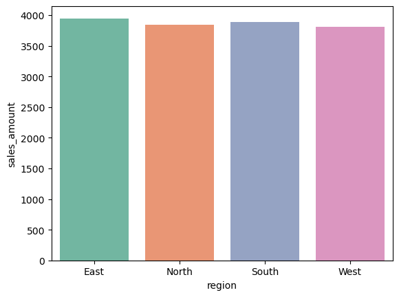
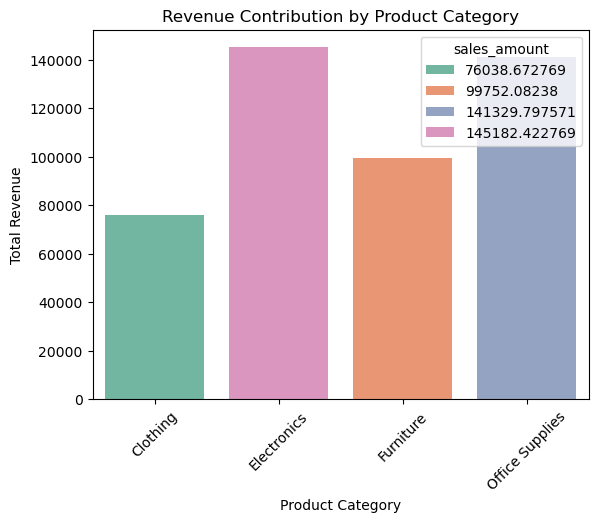

# Sales Data Analysis Project

## Business Problem
The company wants to analyze sales performance across regions,
identify top-performing products, and understand the impact of returns.

## Tools Used
- Python (Pandas, NumPy)
- SQL (Window Functions, Joins)
- Excel

## Dataset
- Real-world messy sales data
- Missing values, unknown regions, returned orders

## Data Cleaning
- Filled missing quantity using median
- Marked unknown regions as NULL
- Returned orders analyzed separately

## Analysis Performed
- Region-wise average sales
- Top revenue generating orders
- Monthly & yearly sales trends
- Product category performance
- Revenue impact of returns

## Key Insights
- Electronics category generated highest revenue
- Returned orders caused revenue loss
- Strong growth observed after 2022

- ## Monthly Sales Trend

- ## Rigion Wise Avg Sales

- ## Return_Comparision

- ## revenue_contribution

